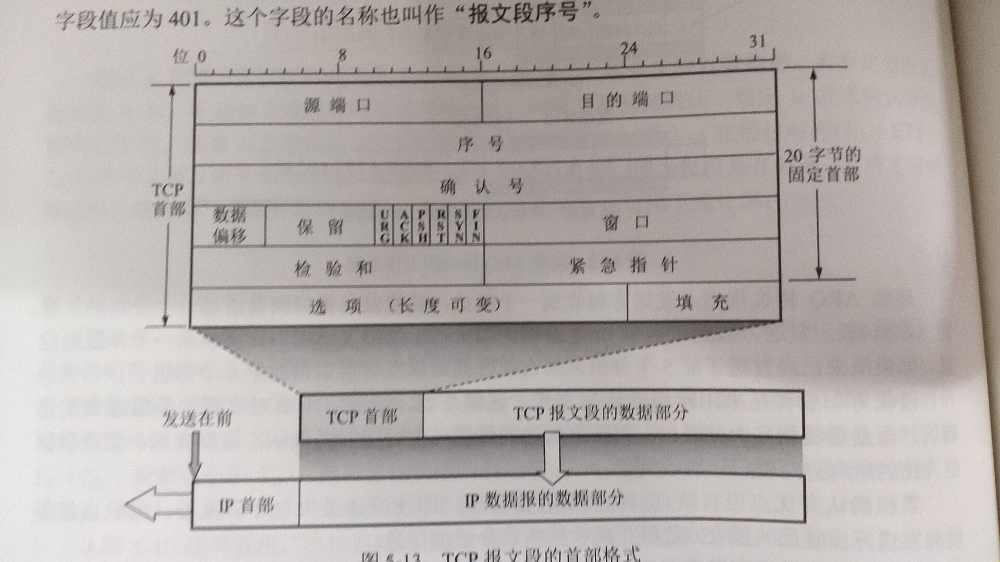

# 计算机网络
### **menu**
* [TCP/UDP区别](#TCP/UDP区别)
  * [TCP可靠性保证](#TCP可靠性保证)

## TCP/UDP区别

---
### <nav style="color: blue">TCP</nav>

> ***TPC特点：***  
> 1.面向连接  
> 2.面向字节流  
> 3.流量控制  
> 4.拥塞控制  
> 5.可靠性（[可靠性如何保证](#TCP可靠性保证)）  

1.TCP结构
  
3.流量控制
通过滑动窗口传输RcvWindow大小，来保证自己的buffer一定不会溢出  
RcvWindow = RcvBuffer-[LastByteRcvd - LastByteRead]  
4.拥塞控制  
> 四个方法：慢启动和拥塞避免 快重传和快恢复  
>> MSS(Maximum Segment Size) : 最大报文段长度  
>> cwnd(congestion window) : 拥塞窗口  
>> sh(ssthresh) : 慢启动门限制  
>> RTT(Round trip time) : 往返时间
>> ack(Acknowledge) : 确认信号
> 
> <nav style="color: blue">原理：</nav>发送方开始发送时，使用慢启动算法，每经过一次RTT拥塞窗口翻倍  
> <nav style="color: blue">限制：</nav>不能大于sh，如果大于sh后，则开始使用拥塞避免算法，每经过一次RTT只增加一个拥塞窗口，避免指数增长过快  
> <nav style="color: blue">lose：</nav>当超时RTT，或者连续收到三个相同的ack，则认定信息丢失  
> <nav style="color: blue">调整：</nav>发生lose的时候，改变sh=cwnd/2;当lose是超时事件时，证明已经发生拥塞，则改变cwnd=1，并且采用慢启动算法;
> 当超时事件是收到三个相同的ack时，假定并没有发生拥塞，则改变cwnd=sh，并启动拥塞避免算法

---
> ***UDP特点：***  
> 1.面向无连接  
> 2.面向报文  
> 3.不提供可靠性  

## TCP可靠性保证

---
> 1.序列化和确认应答信号  
> 2.超时重发控制  
> 3.连接管理  
> 4.滑动窗口  
> 5.流量控制  
> 6.拥塞控制  
